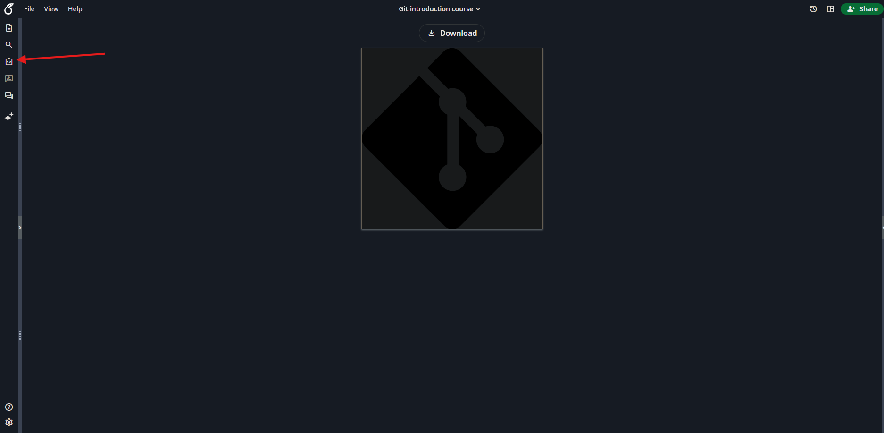
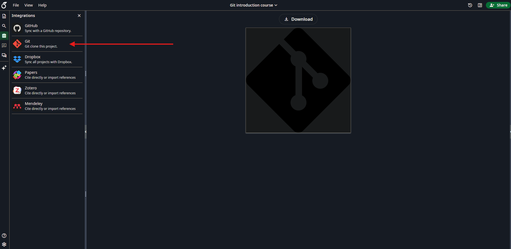
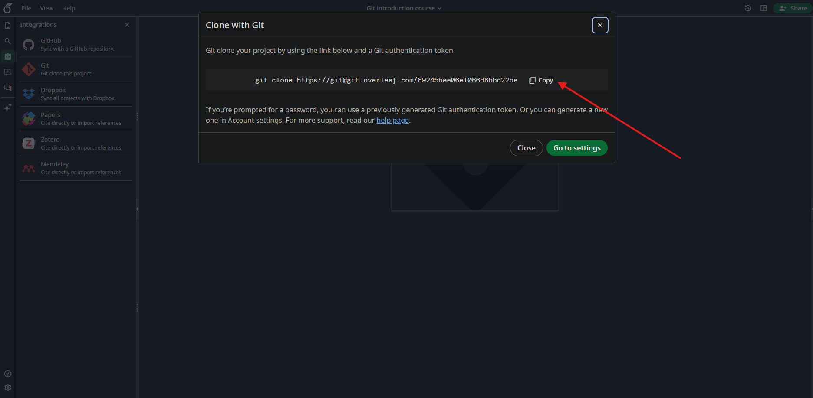

# Starting with Git

[](0.TOC.md)

## Installing Git

### On Windows

To install git, just go to [git-scm/windows](https://git-scm.com/install/windows) and download the installer. Then, just follow the instructions.

### On Linux

To install git on Linux, you can use your package manager. See [git-scm/linux](https://git-scm.com/install/linux) for the exact command for your distribution.

### On MacOS

To install git on MacOS, you can use [Homebrew](https://brew.sh/) (if you don't have it, go to the website and follow the instructions). Then, just run the command:

```bash
brew install git
```

As always, you can also see [git-scm/macos](https://git-scm.com/install/mac) for more options.

## Setting up Git

After installing git, you need to set up your user name and email. This is important as it will be used to identify you in the commit history. To do so, just run the following commands in your terminal:

```bash
git config --global user.name "Your Name"
git config --global user.email "Your email"
```

For all installation and configuration, always use a personnal email to avoid issue when you'll leave your current school or job.

## Some tools to use Git with and how to use them

As said earlier, the original way of using Git is going through the terminal. Hopefully for you, nowadays there is several great user interface to use it, so don't hesitate to use them![^2]

[^2]: Knowing the Git Bash command is still usefull as not every project manager uses a comprehensive UI (see [Overleaf]( #overleaf ) for this).

### GitHub

One of the most famous Git repository hosting service is [GitHub](https://github.com)[^3]. To use it, you can either use the web interface or use some UI such as [GitHub Desktop](https://desktop.github.com/) to manage your repositories both locally and remotely.

1. To use GitHub, you need to create an account first, for this go to [GitHub signup](https://github.com/signup).

2. Then, you can create a new repository by clicking on the "Create New" button on the main page.\


3. You then arrive on [this page](https://github.com/new) where you can fill the information about your repository[^4].

    - Name: The name of your repository
    - Description: A short description of your repository
    - Visibility: Choose between Public (anyone can see your repository) or Private (only you and people you share it with can see it)
    - Initialize this repository with a README: If you check this box, a README file will be created for you automatically.
    - .gitignore: A file that tells Git which files to ignore (not track). You can choose a template based on the type of project you are working on.
    - License: A file that tells others what they can and cannot do with your code. You can choose a license based on your needs.\
    

4. Finally, click on the "Create repository" button to create your repository.\


#### GitHub Desktop

Once you have created your repository, you can use GitHub Desktop to manage it. To do so, just download and install GitHub Desktop from [here](https://desktop.github.com/). Then, open GitHub Desktop and sign in with your GitHub account. You can then clone your repository to your local machine by clicking on the "File" menu and slecting "Clone repository...".\
\

Then select your repository and choose the local path where you want to clone it.\


Congratulations, you have now cloned your repository to your local machine! You can now use GitHub Desktop to manage your repository both locally and remotely.

[^3]: To be noted that GitHub is owned by Microsoft. If you want to avoid it, you can use GitLab or host your own Git server.

### Gitlab

GitLab is another popular Git repository hosting service. It is open source and can be self-hosted. You can use the web interface or use some UI such as [GitKraken](https://www.gitkraken.com/) to manage your repositories both locally and remotely.

1. To use GitLab, you need to create an account first, for this go to [GitLab signup](https://gitlab.com/users/sign_up).

2. Then, you can create a new repository by clicking on the "Project" tab on the main page.\


3. Then click on the "New project" button to create a new repository.\


4. You can then choose to create a blank project, import a project from GitHub or GitLab, or create a project from a template.\


5. if you select a blank project, you will arrive on [this page](https://gitlab.com/projects/new#blank_project) where you can fill the information about your repository:

    - Name
    - Project group or namespace
    - Project slug[^4]
    - Deployement target
    - Visibility level
    - Initialize repository with a README
    - Enable SAST
    - Enable Secret Detection

    

6. Finally, click on the "Create project" button to create your repository.\


### Git Bash

To use Git bash, just open your file explorer, search `git bash` and open it. A bash console will appear, allowing you to navigate through your files and use git command along bash ones.

1. Navigate where you want to clone your git repository or to create it.[^4]

    ```bash
    cd <path/to/location>
    ```

2. Once there, you can either clone a repository with:

    ```bash
    git clone <url> <foldername>
    ```

    or create a repository using

    ```bash
    git init
    ```

You can now open your git folder in your favorite IDE.

### Setting up a git server

You may want to be totally independent of any online platform for privacy, security and controll over your data and your git repository. For this it is possible to create your own git server hosted on your machine or on your own server. As this is a more advanced part, we won't cover it in this course.

### Overleaf

Overleaf is popular online LaTeX editor that also provides Git integration. You can use the web interface to edit your LaTeX documents and use Git to manage your project versioning.[^5]

1. First open your Overleaf project

2. Open the integration menu\


3. Select the Git option\


4. Copy the command\


5. Follow [the git bash instructions]( #git-bash ) to go to the right folder and clone your project repository

Don't forget reconnect to Internet to push your changes to the remote repository and see them on Overleaf. (The push and pull are done automatically by Overleaf when you are connected to Internet, so you don't have to do anything special)

[^4]: See a repository as a folder containing your project files. Its name should be relevant to the project itself and must be unique on your account/main folder.

[^5]: Unfortunately, Overleaf Git integration is only available for premium users only, however if the owner of the project owns it, you can use it too.

[](1.Introduction.md) [](3.WorkingWithGit.md)